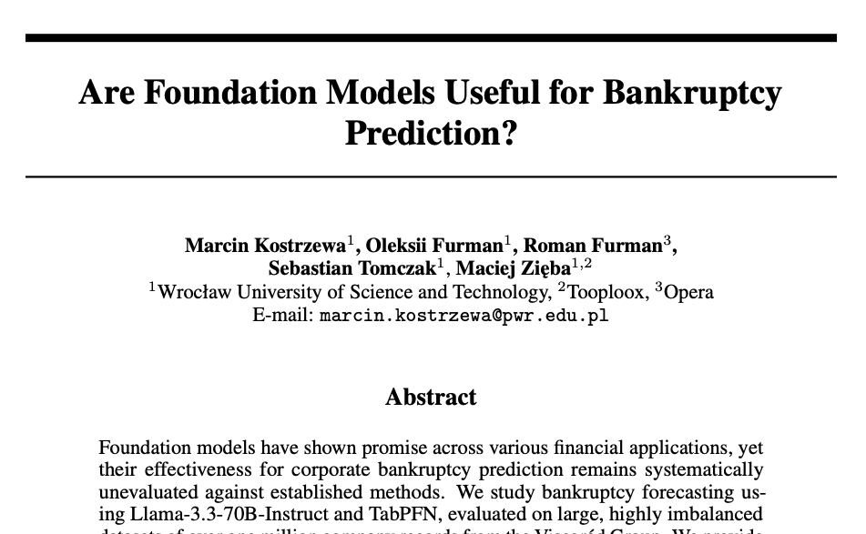
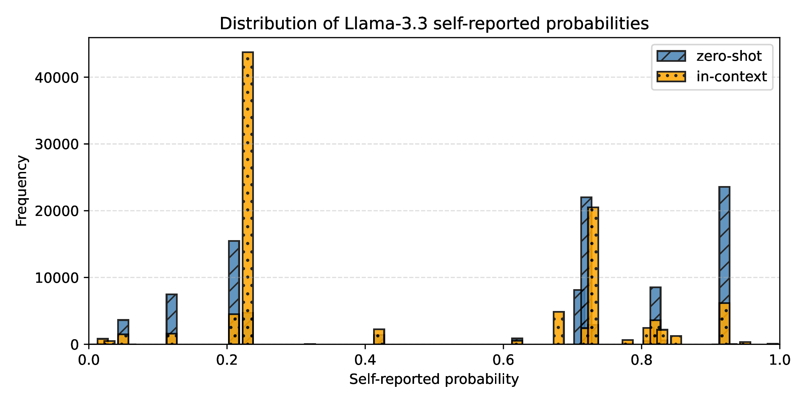
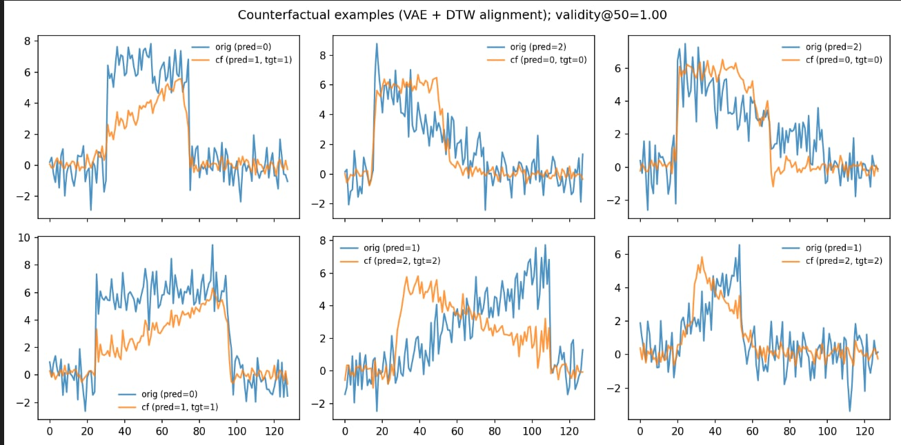

# Status update

## November 2025

### Marcin Kostrzewa

---

# Agenda

 

<ol>
    <li> NeurIPS workshop paper</li>
     
    <li> Time series counterfactual explanations + ACIIDS paper</li>
     
    <li> Next steps</li>
     
</ol>

<SlideNumber/>

---

# NeurIPS workshop paper (I)

<ul style="padding-left:1.2em;">
    <li style="margin-bottom:0.6em">TabPFN and Llama-3.3-70B models were used for structured data classification problem</li>
    <li style="margin-bottom:0.6em">Evaluated against standard methods: XGBoost, Catboost, MLP, Logistic Regression, LightGBM</li>
    <li style="margin-bottom:0.6em">Highly imbalanced dataset of company-year records</li>
</ul>

<SlideNumber/>

---

# NeurIPS workshop paper (II)

As it turns out, foundation models are not very useful.

<table style="font-size: 0.55em; width: 80%; height: 30%;">
    <caption style="caption-side: top; margin-bottom: 0.6em;">
    Performance across prediction horizons (ROC-AUC /  F1-score)
   </caption>
  <thead>
    <tr style="border-top: 2px solid black; border-bottom: 1px solid black;">
      <th>Model</th>
      <th>h = 0</th>
      <th>h = 1</th>
      <th>h = 2</th>
      <th>h = 3</th>
      <th>h = 4</th>
    </tr>
  </thead>
  <tbody>
    <tr>
      <td>XGBoost</td>
      <td><b>0.996</b>/<b>0.465</b></td>
      <td><b>0.968</b>/0.200</td>
      <td><b>0.894</b>/0.198</td>
      <td>0.896/0.055</td>
      <td><b>0.891</b>/0.024</td>
    </tr>
    <tr>
      <td>CatBoost</td>
      <td><b>0.996</b>/0.431</td>
      <td>0.965/<b>0.238</b></td>
      <td>0.886/0.161</td>
      <td><b>0.901</b>/0.067</td>
      <td>0.883/0.062</td>
    </tr>
    <tr>
      <td>LightGBM</td>
      <td><b>0.996</b>/0.459</td>
      <td>0.965/0.229</td>
      <td>0.878/<b>0.180</b></td>
      <td>0.888/0.060</td>
      <td>0.877/<b>0.069</b></td>
    </tr>
    <tr>
      <td>MLP</td>
      <td>0.994/0.404</td>
      <td>0.959/0.157</td>
      <td>0.848/0.059</td>
      <td>0.895/<b>0.071</b></td>
      <td>0.877/0.021</td>
    </tr>
    <tr>
      <td>LR</td>
      <td>0.983/0.167</td>
      <td>0.952/0.148</td>
      <td>0.853/0.064</td>
      <td>0.858/0.045</td>
      <td>0.850/0.012</td>
    </tr>
    <tr>
      <td>TabPFN</td>
      <td>0.987/0.400</td>
      <td>0.951/0.196</td>
      <td>0.800/0.131</td>
      <td>0.823/0.063</td>
      <td>0.771/0.024</td>
    </tr>
    <tr>
      <td>Llama-3.3</td>
      <td>0.945/0.141</td>
      <td>0.914/0.091</td>
      <td>0.796/0.020</td>
      <td>0.823/0.010</td>
      <td>0.782/0.012</td>
    </tr>
    <tr>
      <td>Llama-3.3 (ICL)</td>
      <td>0.966/0.114</td>
      <td>0.932/0.064</td>
      <td>0.817/0.022</td>
      <td>0.807/0.019</td>
      <td>0.780/0.015</td>
    </tr>
  </tbody>
</table>

<SlideNumber/>

---

# NeurIPS workshop paper (III)

<SlideNumber/>

---

# Time series counterfactual explanations

 

**Goal:** Generate modified time series $X'$ such that $f(X') \neq f(X)$

**Desirable properties:**
- **Validity:** $f(X') = y_{\text{target}}$
- **Proximity:** $X' \approx X$ (minimal changes)
- **Plausibility:** $X'$ realistic within target class
- **Sparsity:** localized modifications

<SlideNumber/>

---

# Existing approaches

**Substitution-based methods:**
- CoMTE, Native Guide, shapelet-based methods
- Replace segments with training data
- Limited to existing patterns, discontinuous changes

**Evolutionary algorithms:**
- TSEvo, Sub-SpaCE
- No explicit plausibility guarantees or indirect via autoencoder

**Deep learning:**
- LatentCF++, Glacier, Time-CF
- Perturb in latent space or use GANs
- Plausibility through reconstruction constraints

<SlideNumber/>

---

# Dynamic Time Warping (DTW)

**Cost matrix:** $\Delta(X, Y) = [\delta(x_i, y_j)]_{ij} \in \mathbb{R}^{m \times m'}$

**Alignment:** Binary matrix $A \in \mathcal{A}_{m,m'}$ (valid paths from $(1,1)$ to $(m,m')$)

**DTW distance:**

$$\text{DTW}(X, Y) = \min_{A \in \mathcal{A}_{m,m'}} \langle A, \Delta(X, Y) \rangle$$

 

<!--  -->
<figure style="float: right; width: 59%; margin-left: 2em;">
  
  <figcaption style="text-align: center; font-size: 0.8em; margin-top: 0.5em;">
    <a href="https://rtavenar.github.io/blog/dtw.html" target="_blank">Source</a>
  </figcaption>
</figure>

- Handles temporal misalignments
- **Problem:** Non-differentiable

<SlideNumber/>

---

# Soft-DTW

**Soft-minimum operator:**

$${\min}^\gamma\{a_1, \ldots, a_n\} = -\gamma \log \sum_{i=1}^{n} e^{-a_i/\gamma}$$

**Soft-DTW distance:**

$$\text{DTW}^\gamma(X, Y) = {\min}^\gamma \{\langle A, \Delta(X, Y) \rangle : A \in \mathcal{A}_{m,m'}\}$$

 

- $\gamma > 0$ smoothing parameter
- As $\gamma \to 0^+$: converges to standard DTW
- **Differentiable:** enables gradient-based optimization

<SlideNumber/>

---

# ACIIDS paper (I)

**Overall objective:**

$$\mathcal{L}_{\text{CF}} = \mathcal{L}_{\text{prox}} + \mathcal{L}_{\text{sparse}} + \lambda \cdot \left(\mathcal{L}_{\text{valid}} + \mathcal{L}_{\text{DTW}}\right)$$

where $\lambda$ controls validity and plausibility weight.

**Proximity loss:**

$$\mathcal{L}_{\text{prox}} = \frac{1}{dT} \|X' - X\|_2^2$$

**Sparsity loss:**

$$\mathcal{L}_{\text{sparse}} = \frac{1}{dT} \|X' - X\|_1$$

**Validity loss:**

$$\mathcal{L}_{\text{valid}} = \max\left(0, \tau - p_f\left(y_{\text{target}}|X'\right)\right)$$

<SlideNumber/>

---

# ACIIDS paper (II)

**DTW plausibility loss:**

$$\mathcal{L}_{\text{DTW}} = \frac{1}{k} \sum_{Y \in \mathcal{N}_k(X, y_{\text{target}})} \text{DTW}^\gamma(X', Y)$$

where $\mathcal{N}_k(X, y_{\text{target}})$ is a set of $k$ nearest unlike neighbors from target class.

 

**Key advantage:** Explicit alignment with target class distribution through differentiable soft-DTW.

<SlideNumber/>

---

# ACIIDS paper (III)

<SlideNumber/>

---

# Next steps

<ul>
    <li>Robust counterfactual explanations</li>
    <li>Energy based model formulation for counterfactual explanations</li>
    <li>Better time series counterfactuals</li>
    <li>Text counterfactuals via DPO</li>
    <li>Economic data: Imbalanced data, counterfactual explanations, foundation models finetuning, model's uncertainty calibration</li>
</ul>

<SlideNumber/>

---

# Question for discussion

 

How can <b>prototypes</b> for a dataset be found provided that the procedure should be:
  - random &mdash; we get a slightly different prototypes each time,
  - fast &mdash; we can run the procedure $K$ times and do not care.

<SlideNumber/>

---

  <h1 style="font-size: 5em;">Thanks!</h1>

